# CampusEats
CampusEats is a web application designed to enhance the university dining experience by providing a centralized platform for meal planning, ordering, and restaurant recommendations. The app integrates intelligent algorithms to suggest restaurants and meals based on user preferences, dietary restrictions, and campus restaurant availability.

## Features

- **Client Interface**: Students can browse the restaurants, menu items, place orders, and track their orders.
- **Restaurant Interface**: Restaurant staff can manage menu items, view and update orders, and track order delivery.
- **API**: A robust backend API to handle order processing, user management, and data storage.

## Installation

### Prerequisites

- Node.js
- npm (Node Package Manager)
- MySQL

### Steps

1. **Clone the Repository**

    ```bash
    git clone https://github.com/AbdalrahmanAtia/CampusEats.git
    cd CampusEats
    ```

2. **Install Dependencies**

    Navigate to the backend directory and install the dependencies:

    ```bash
    cd api
    npm install
    ```

    Then, navigate to the frontend directory and install the dependencies:

    ```bash
    cd ../client
    npm install
    ```

    Then, navigate to the admin directory and install the dependencies:

    ```bash
    cd ../restaurant
    npm install
    ```

3. **Set Up MySQL Database**

    Create a new MySQL database and run the provided SQL script to set up the required tables.

4. **Set Up Environment Variables**

    Copy the sample environment file to create a new `.env` file and add your database credentials:

    ```bash
    cp api/.env.sample api/.env
    ```

    Edit the `api/.env` file to include your database credentials:
```
PORT=5000
MYSQL_DB_HOST="db host url"
MYSQL_DB_PORT="dbport"
MYSQL_DB_USER="dbUsername"
MYSQL_DB_PASSWORD="password"
MYSQL_DB_DATABASE=CampusEats
```

5. **Run the Application**

    Start the backend server:

    ```bash
    cd api
    npm run dev
    ```

    Start the client frontend development server:

    ```bash
    cd ../client
    npm run dev
    ```

    Start the restaurant frontend development server:

    ```bash
    cd ../restaurant
    npm run dev
    ```

6. **Access the Application** at

  Open your browser and go to `http://localhost:5173` for client interface.
	Open your browser and go to `http://localhost:5174` for restaurant interface.


## Screenshots

### Client side interface screenshots

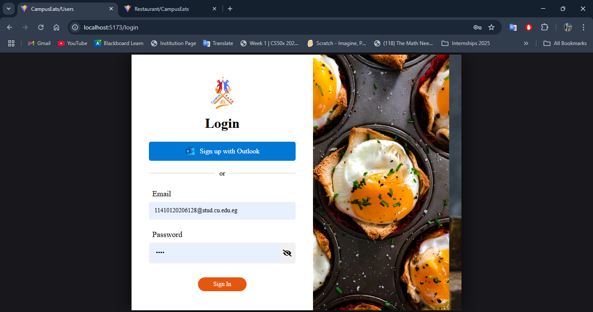

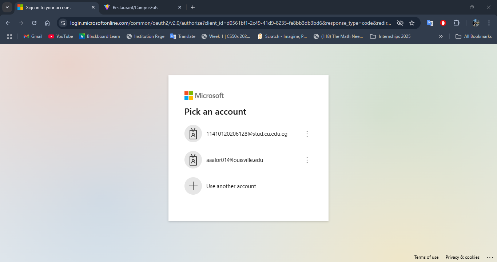

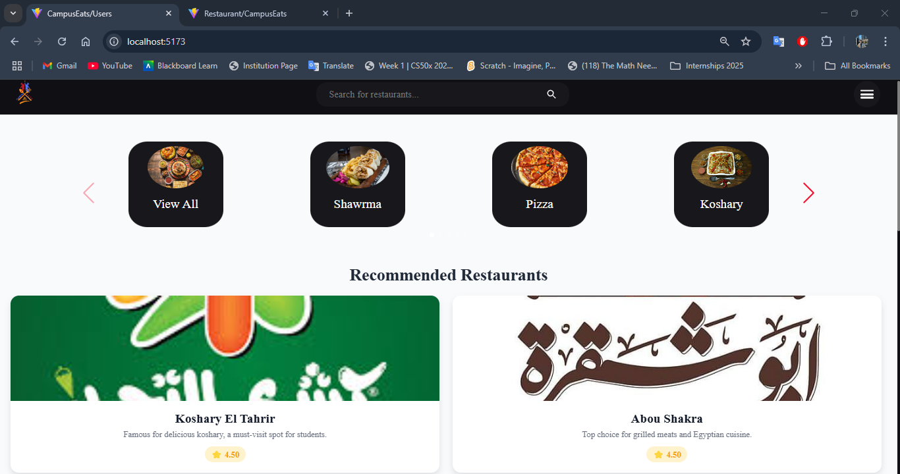

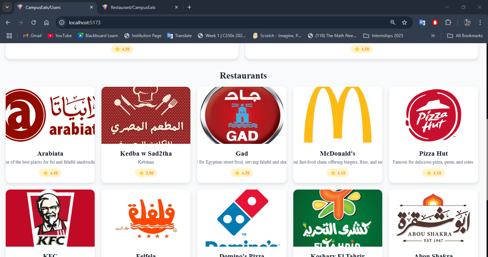

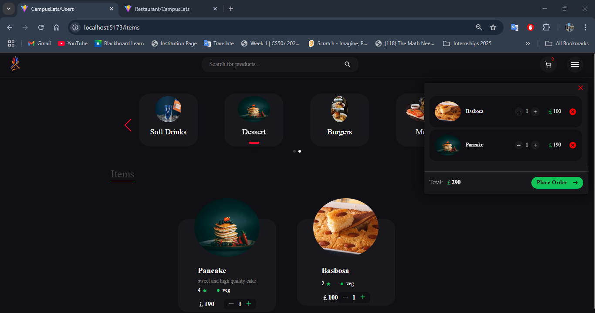

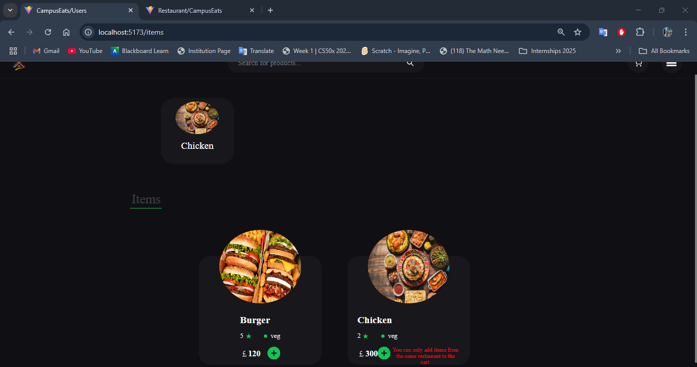

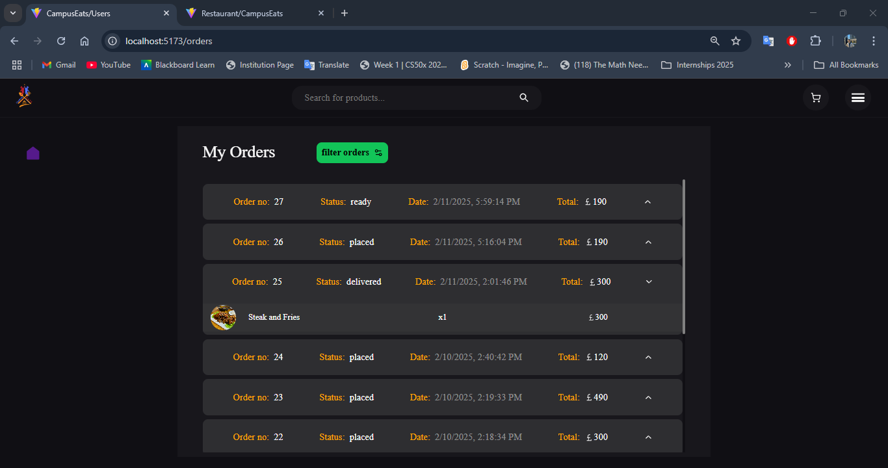

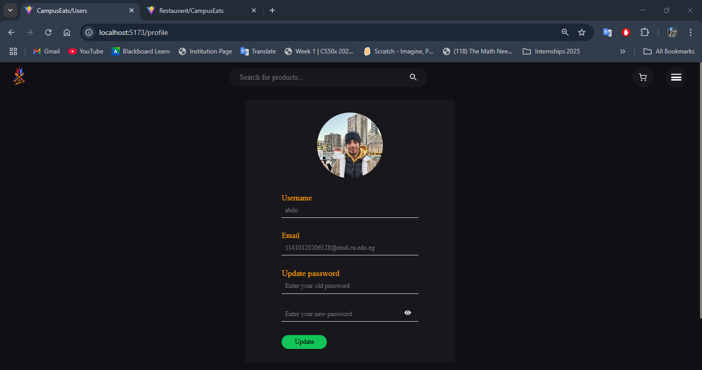

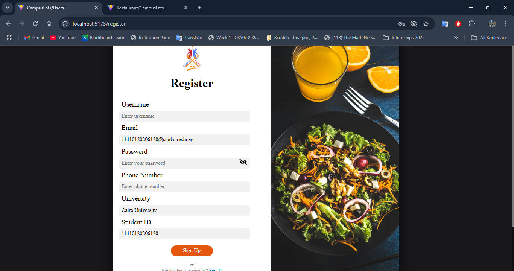


### Restaurant Dashboard screenshots

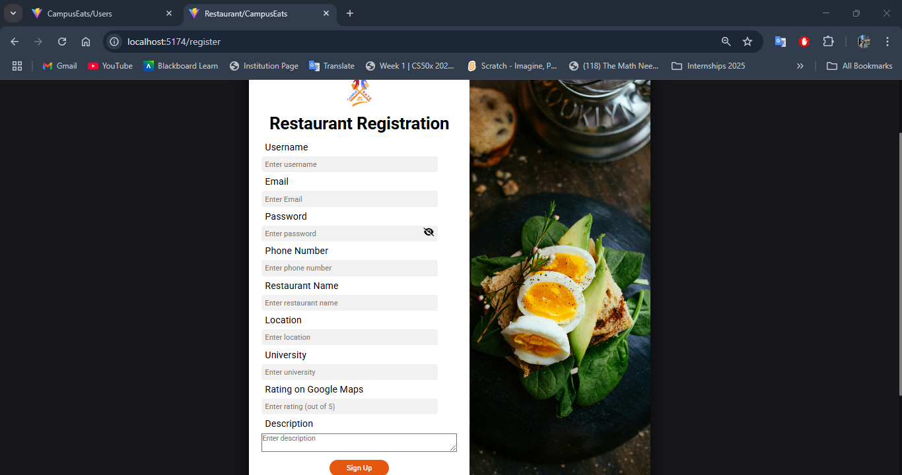

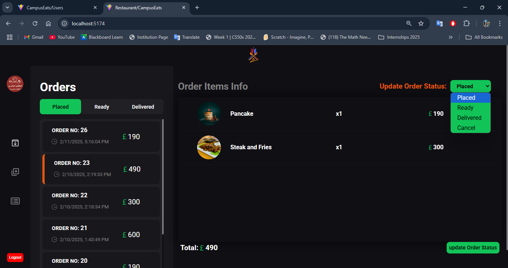

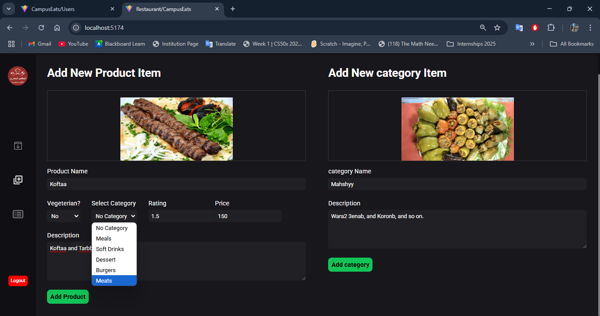

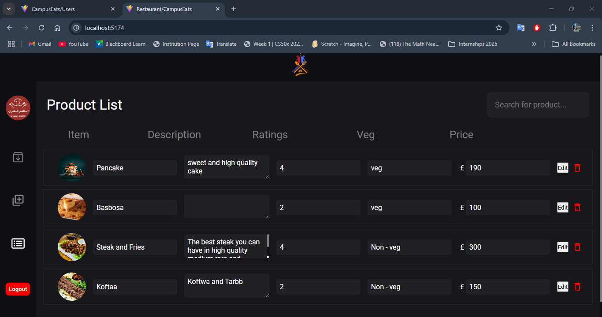

